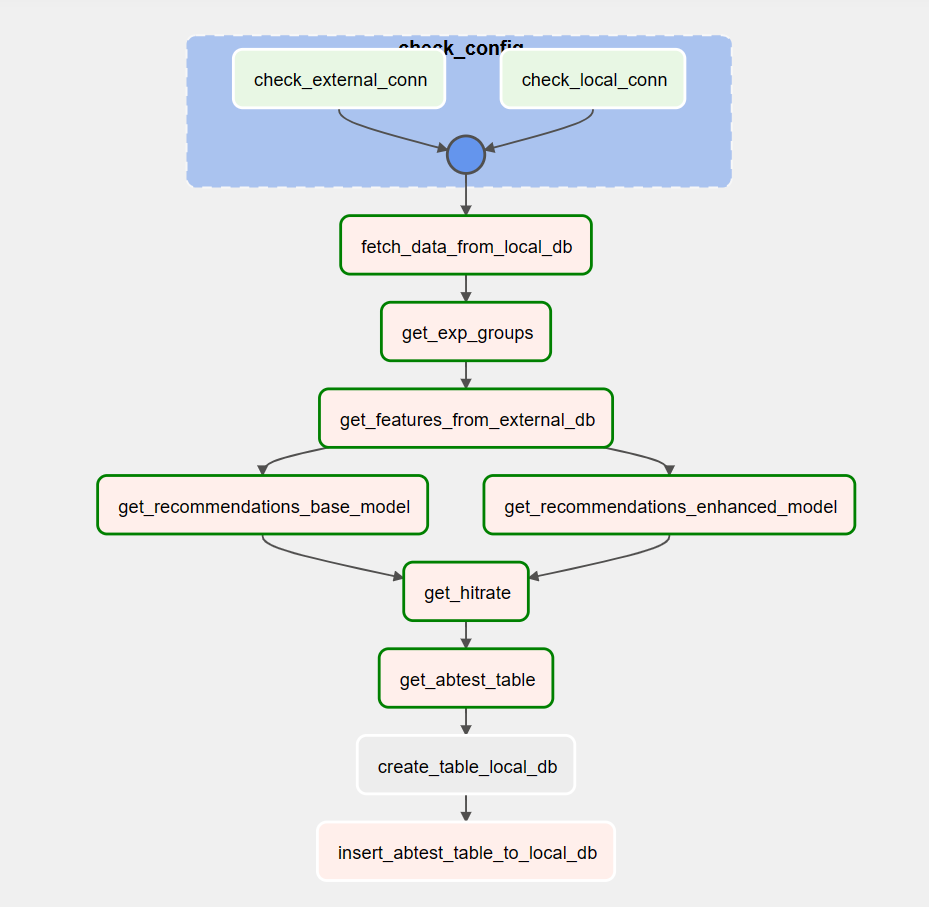

# Recommendation microservice
Modification of microservice based on Start ML final project by karpov.courses  
#fastapi #docker #catboost #postgres #airflow #bert #DEC #IDEC  
#TODO: 1) catboost tuning, 2) add tests, 3) fix recommendation suggestion

* base_model.ipynb - catboost classification with text features extracted from TF-IDF representation with PCA decomposition
* enhanced_model.ipynb - catboost classification with text features extracted from BERT representation with IDEC-aug clusterization
* to test microservice and get recommendations *on the fly* simply run test_app.py or use Postman
* abtests need for recognition of statistically significant change of **HitRate@5** metrics of both models. To see methodology of abtesting see `/abtest` directory. *Note! For now, KarpovCourses provided recommedations are used (see `/abtest/views.csv`)*
* to run scheduled abtesting build Dockerfile with `docker build . -t extending_airflow:latest` in /airflow/Dockerfile and run .yaml  with `docker-compose up -d` and open airflow webserver in browser (`localhost:8080/`)

Proposed DAG structure:

# Intro
I wanted to extend the final project at Start ML course by **1)** adding more sophisticated text clustering technique and **2)** building ML abtest pipeline with airflow.

To do first, I found an interesting [paper by Subakti et al. (2022)](https://journalofbigdata.springeropen.com/articles/10.1186/s40537-022-00564-9), which relates to the problem of BERT embeddings clusterization. In paper, there are several proposed strategies: proper BERT embeddings handling (pooling&normalization) combined with different techniques, such as KMeans, DEC (Deep Embedded Clustering), IDEC (Improved DEC), fuzzy C-Means. I tried to play with DEC&IDEC because they had the best performance (see Subakti's paper). Unfortunately, there was no acceptable pytorch implementation, so I rewrote existing solutions and applied rewritten DEC and IDEC for current task. *See [my DEC/IDEC_mnist repo](https://github.com/grokhi/pytorch_DEC_IDEC_2022) for details*

To do second, I integrated all steps of productional workflow and realised a Local Executory airflow solution with PythonOperator() style DAGs. Input and output files were fetched and uploaded to a local postgres database. XCom were used for transaction of data between tasks. Don't forget to create `abtest_db` database in DBeaver (or any other preferred db client). Input files `abtest/views.csv` and `abtest/likes.csv` were added to `abtest_db` manually with DBeaver. As a result of `get_abtest_table` dag, table `ab_test_{{ ds }}` is created (`ds` stands for airflow logical date). Later `ab_test` dag fetches that data and makes an automatic A/B test. Properties of airflow webserver connection:
* Connection Id : postgres_localhost
* Connection Type : Postgres
* Host : host.docker.internal
* Schema : abtest_db
* Login : airflow
* Password : airflow
* Port : 5432 

# Modelling Results
- Improved Deep Embedded Clustering (IDEC) trained on augmented dataset (backtranslation augmentation using 'bert_multilingual_uncased') showed **93%** cluster accuracy (b/line kmeans **58%**). Extracted features were used for catboost training
- Unfortunately, default catboost model (**.67**) showed higher ROC-AUC score than in enhanced model (**.65**). Need to tune it
- Tuned catboost results: #TODO
- Change of results in Hitrate score for control (**.71**) and test (**.72**) recommendations is statistically significant *Note! For now, KarpovCourses provided recommedations are used (see `/abtest/views.csv`)*. Null-hypothesis of means equality is rejected (Mannwhitneyu test, p-value<0.05)